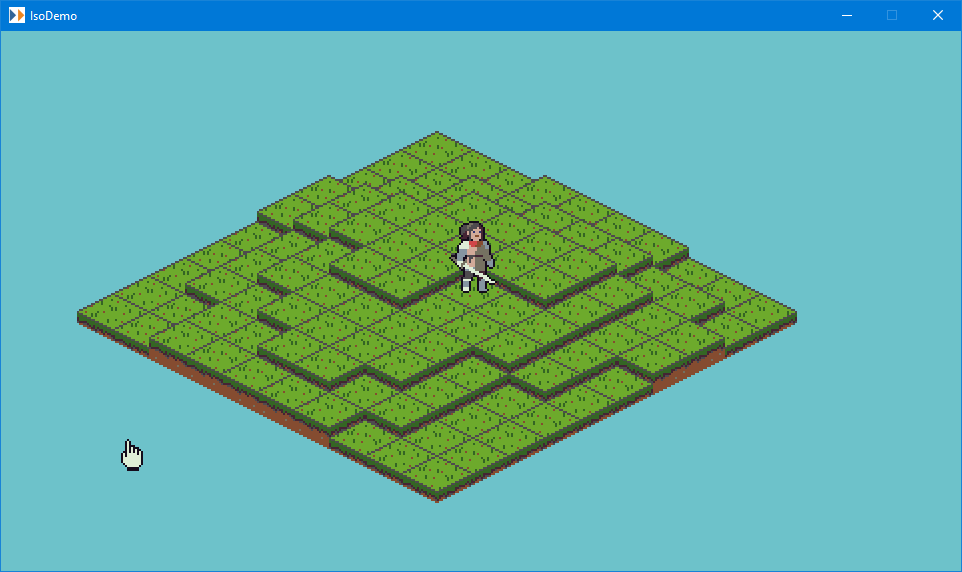

Quick demo of some isometric math & rendering, using MonoGame and [PlayPlayMini](https://github.com/BenMakesGames/PlayPlayMini).

Other than the warrior image, which is from https://opengameart.org/content/4-direction-animated-warrior, all graphics and code in this project are released to the public domain. See the LICENSE for more info.

